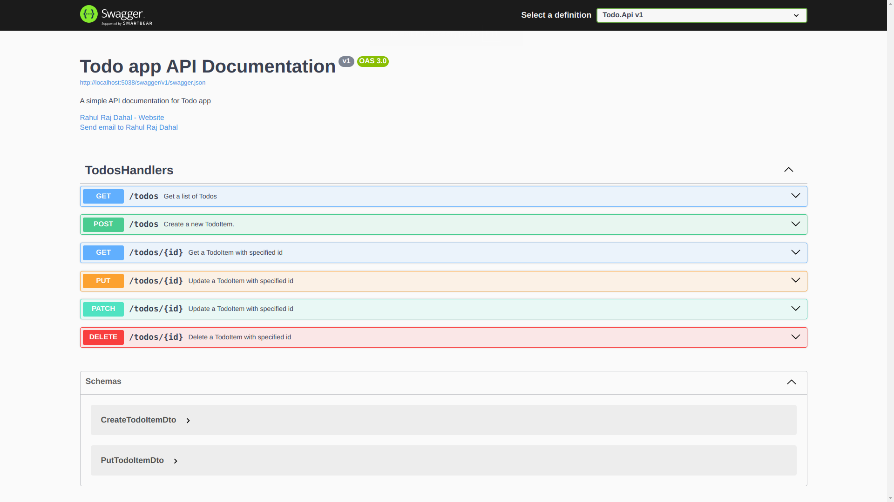

# [Todo.API](https://github.com/rahulrajdahal/todo-dotnet). Create Tasks for you to complete

Add Tasks to the list and check them off.

- Add/Update Tasks.
- View tasks and todos.
- Visualize APIs for your use.

## Preview

[](https://github.com/rahulrajdahal/todo-dotnet)

## 🏗 Development Guide

### 1. clone the repository

```sh
git clone https://github.com/rahulrajdahal/todo-dotnet.git
```

### 2. Connect to your Database 💾

Create a **.env** file and update the value to your requirements.

### 3. Run the server

```sh
dotnet run
```

#### OR

### Run the server in watch mode

```sh
dotnet watch
```

## 🚀 Project Structure

Inside of project [Todo.API](https://github.com/rahulrajdahal/todo-dotnet), you'll see the following folders and files:

```text
 ____________________________
/
|── Data
│   │── Context.cs
│   └── Extensions.cs
│── Dtos
│   └── ModelDto.cs
│── Endpoints
│   │── FirstEndpoints.cs
│   └── SecondEndpoints.cs
│── Entities
│   └── Entity.cs
│── Handlers
│   └── Handler.cs
│── Mappings
│   └── Mapping.cs
│── Migrations
│   └── DB_Migration.cs
│   └── Program.cs
│── Todo.sln
└── Readme.md
\____________________________

```

## 🧞 Commands

All commands are run from the root of the project, from a terminal:

| Command        | Action                                          |
| :------------- | :---------------------------------------------- |
| `dotnet run`   | Start the dotnet server.                        |
| `dotnet watch` | Starts the dotnet server and watch for changes. |
| `dotnet build` | Build the dotnet server                         |
