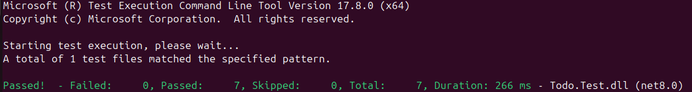

# [Todo.Test in .NET](https://github.com/rahulrajdahal/todo-dotnet). APIs to create Tasks for you to complete

Add Tasks to the list and check them off.

- Add/Update Tasks.
- View tasks and todos.
- Visualize APIs for your use.

## Preview

[](https://github.com/rahulrajdahal/todo-dotnet)

## 🏗 Development Guide

### 1. clone the repository

```sh
git clone https://github.com/rahulrajdahal/todo-dotnet.git
```

### 2. Run the Todo Server

### 3. Run the test files

```sh
dotnet test
```

## 🚀 Project Structure

Inside of project [Todo.Test](https://github.com/rahulrajdahal/todo-dotnet), you'll see the following folders and files:

```text
 _________________________
/
├── Todo.Test/
|   ├── TodosTest.cs
|   ├── GlobalUsings.cs
│   └── Program.cs
│── Todo.sln
└── Readme.md
\_________________________

```

## 🧞 Commands

All commands are run from the root of the project, from a terminal:

| Command       | Action             |
| :------------ | :----------------- |
| `dotnet test` | Run the test files |
